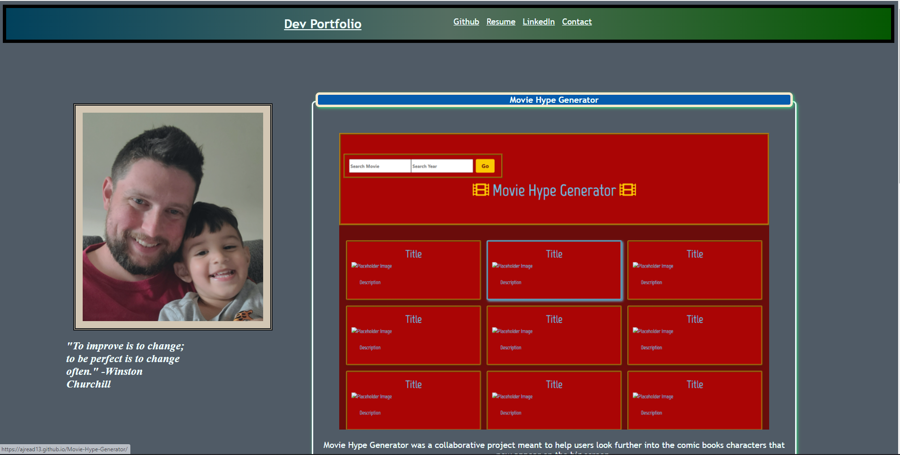

# My Portfolio
## Description
- This being the second iteration of my developer portfolio, I have updated it to reflect some of the actual work and projects I have worked on thus far.
- The purpose of this is to begin to showcase my abilities and work through a centralized location so that potential employers can view what I have worked on so far.
- As I continue to learn and develop additional skills, I will be able to schowcase them here on this page as well as provide links to projects that have particular emphasis on certain facets of development.  

## Table of Contents (Optional)

- [Installation](#installation) -- No install necessary
- [Usage](#usage)-Open in Browser
- [Credits](#credits) N/A
- [License](#license) MIT License

## Installation
No install required
## Usage
Open in browser. https://ajread13.github.io/my_portfolio/
## Screenshot

## Credits
List of collaborators: None
## License
MIT License

Copyright (c) [2021] "Andrew J Read"

Permission is hereby granted, free of charge, to any person obtaining a copy
of this software and associated documentation files (the "Software"), to deal
in the Software without restriction, including without limitation the rights
to use, copy, modify, merge, publish, distribute, sublicense, and/or sell
copies of the Software, and to permit persons to whom the Software is
furnished to do so, subject to the following conditions:

The above copyright notice and this permission notice shall be included in all
copies or substantial portions of the Software.

THE SOFTWARE IS PROVIDED "AS IS", WITHOUT WARRANTY OF ANY KIND, EXPRESS OR
IMPLIED, INCLUDING BUT NOT LIMITED TO THE WARRANTIES OF MERCHANTABILITY,
FITNESS FOR A PARTICULAR PURPOSE AND NONINFRINGEMENT. IN NO EVENT SHALL THE
AUTHORS OR COPYRIGHT HOLDERS BE LIABLE FOR ANY CLAIM, DAMAGES OR OTHER
LIABILITY, WHETHER IN AN ACTION OF CONTRACT, TORT OR OTHERWISE, ARISING FROM,
OUT OF OR IN CONNECTION WITH THE SOFTWARE OR THE USE OR OTHER DEALINGS IN THE
SOFTWARE.
## Badges
N/A
## Features
Built with mobile devices and viewports in mind.
## How to Contribute
No contributions necessary.
## Tests
Tested during milestones.