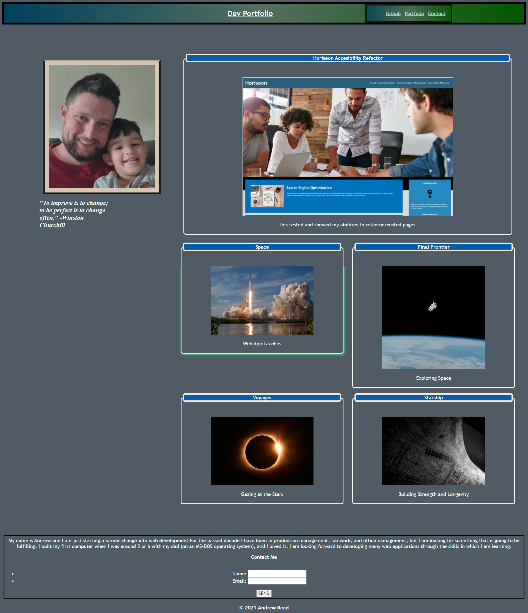

# My Portfolio
## Description
- The scope of this assignment was to build a web page from scratch that will serve as our Portfolio page.
- I have built this project to showcase my abilities to write and stylize a web page from the ground up and also create a page to showcase my current, completed works.
- I ran into many issues during the construction of this page, but through diligent research, have managed to overcome most of them, namely, FLexbox.  
- Through this assignment I have learned better practices for nesting flexbox as well many techniques to make a page more appealing and dynamic.
## Table of Contents (Optional)
If your README is long, add a table of contents to make it easy for users to find what they need.
- [Installation](#installation) -- No install necessary
- [Usage](#usage)-Open in Browser
- [Credits](#credits) N/A
- [License](#license) MIT License
## Installation
No install required
## Usage
Open in browser. https://ajread13.github.io/my_portfolio/
## Screenshot

## Credits
List of collaborators: None
## License
MIT License

Copyright (c) [2021] "Andrew J Read"

Permission is hereby granted, free of charge, to any person obtaining a copy
of this software and associated documentation files (the "Software"), to deal
in the Software without restriction, including without limitation the rights
to use, copy, modify, merge, publish, distribute, sublicense, and/or sell
copies of the Software, and to permit persons to whom the Software is
furnished to do so, subject to the following conditions:

The above copyright notice and this permission notice shall be included in all
copies or substantial portions of the Software.

THE SOFTWARE IS PROVIDED "AS IS", WITHOUT WARRANTY OF ANY KIND, EXPRESS OR
IMPLIED, INCLUDING BUT NOT LIMITED TO THE WARRANTIES OF MERCHANTABILITY,
FITNESS FOR A PARTICULAR PURPOSE AND NONINFRINGEMENT. IN NO EVENT SHALL THE
AUTHORS OR COPYRIGHT HOLDERS BE LIABLE FOR ANY CLAIM, DAMAGES OR OTHER
LIABILITY, WHETHER IN AN ACTION OF CONTRACT, TORT OR OTHERWISE, ARISING FROM,
OUT OF OR IN CONNECTION WITH THE SOFTWARE OR THE USE OR OTHER DEALINGS IN THE
SOFTWARE.
## Badges
N/A
## Features
Build with mobile devices and viewports in mind.
## How to Contribute
No contributions necessary.
## Tests
Tested during milestones.